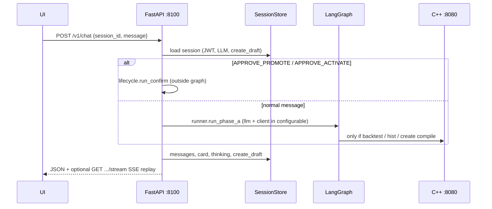
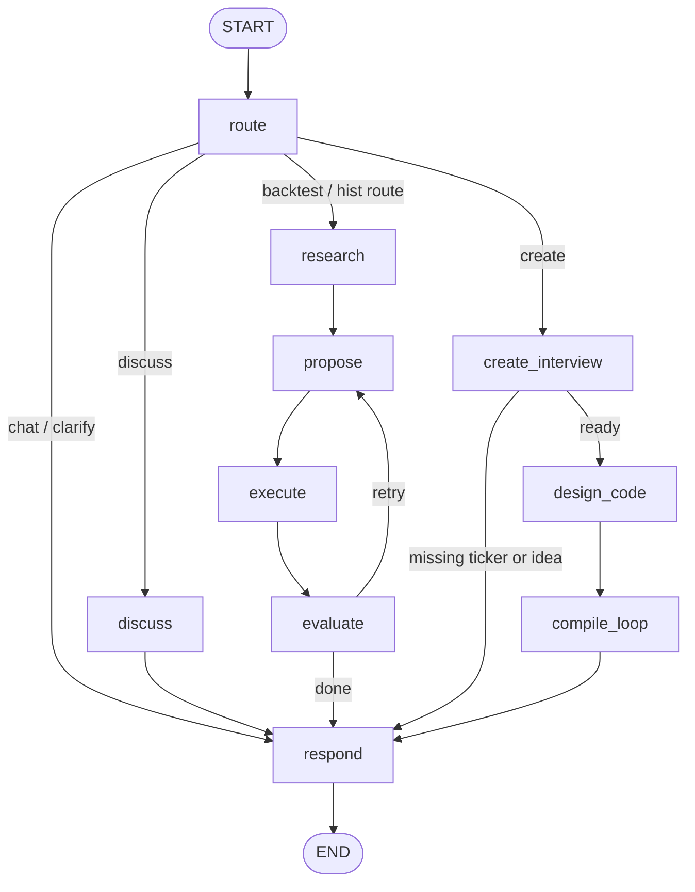
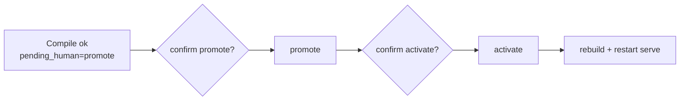
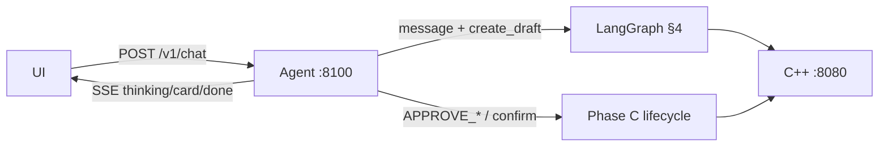

# AlgoCraft-Agent — Architecture (as implemented)

**Stack:** Python 3.12 · uv · FastAPI (:8100) · LangGraph · LangChain · httpx · SSE  
**Sibling:** AlgoCraft C++ engine (:8080) — capital, bars, fills, risk, compile sandbox  
**Code walkthrough (LangGraph step-by-step):** [`CODE_FLOW.md`](CODE_FLOW.md)  
**Build / checklist / locked contracts:** [`AI_AGENT.md`](AI_AGENT.md)  
**Run book:** [`../README.md`](../README.md)

This file is the mental model of the **current** repo. It is not a build plan.

---

## 1. What this repo is

A chat orchestrator between UI and AlgoCraft C++:

| Layer | Role |
|-------|------|
| **UI** (:5173) | JWT, provider/model dropdowns, chat + thinking trail |
| **Agent** (:8100) | Understand message → route intent → call C++ / LLM → reply + SSE |
| **C++** (:8080) | Strategies, routers, backtests, hist runs, compile/promote/activate |

Python never owns bars or risk. It picks a lane, fills `chosen`, and calls HTTP tools with the user’s JWT.

```
AlgoCraft-UI (:5173)
    ├── JWT ──► AlgoCraft C++ (:8080)
    └── JWT ──► AlgoCraft-Agent (:8100)
                    └── httpx + Bearer ──► AlgoCraft C++ (:8080)
```

---

## 2. Request flow (one chat turn)



**Sessions** are in-memory (`app/store/sessions.py`): JWT, provider/model/temp, workbook, history, `create_draft`, `pending_human`, last card/thinking/SSE events.

---

## 3. Product model (router-first)

Entry node is always **`route`**. The agent does **not** silent-backtest.

| Intent | Trigger (examples) | Path |
|--------|--------------------|------|
| `chat` | `hi`, thanks | → `respond` (help text, no C++) |
| `clarify` | Ambiguous | → `respond` (ask pick: backtest / discuss / create) |
| `discuss` | explain / list / “X lets discuss this” | → `discuss` → `respond` (no execute) |
| `backtest` | backtest / typo `backest` / “with strategy …” + ticker | research → propose → execute → evaluate → respond |
| `route` | hist run / router replay | same execute path, `start_run` |
| `create` | create/generate new strategy | `create_interview` → (ready?) `design_code` → `compile_loop` → respond |

**Natural language helpers** live in `app/graph/nodes/entities.py`: tickers (`M&M`), dates (`28th sept 26`), strategy names, fuzzy “backtest”, match against catalog + `docs/cpp/strategies/`. Optional LLM assists **route** when rules say `clarify`, and **discuss** / codegen when session has keys.

---

## 4. LangGraph brain

Source of truth: `app/graph/graph.py`. Every node appends **thinking** crumbs (`app/graph/thinking.py`) for the UI dropdown.



### 4.1 Nodes

| Node | File | Does |
|------|------|------|
| `route` | `nodes/route.py` | Rules (+ optional LLM) → `intent`, tickers, `topic_strategy`, start/cancel `create_draft` |
| `classify` | `nodes/classify.py` | Thin alias → `route_intent` (compat) |
| `entities` | `nodes/entities.py` | Shared NL parse/match (not a graph node) |
| `discuss` | `nodes/discuss.py` | Focused strategy explain from catalog/docs (+ optional LLM) |
| `create_interview` | `nodes/create_interview.py` | Multi-turn: need ticker + idea → `create_ready` |
| `research` | `nodes/research.py` | `list_strategies` / `list_routers` / instruments |
| `propose` | `nodes/propose.py` | Exact C++ names + session window → `chosen` |
| `execute` | `nodes/execute.py` | `start_backtest` or hist `start_run` + events |
| `evaluate` | `nodes/evaluate.py` | Soft pass/weak/fail; may set `_retry` |
| `design_code` | `nodes/design_code.py` | Emit strategy `hpp`/`cpp` (LLM or template) |
| `compile_loop` | `nodes/compile_loop.py` | `agent_compile` ≤5; on ok set `pending_human=promote` |
| `respond` | `nodes/respond.py` | User text + `card` JSON |
| Phase C | `lifecycle.py` + `human_gate` / `promote` / `activate` | **Outside** main graph via confirm API / `APPROVE_*` |

**LLM injection:** `config["configurable"]["llm"]` from `runner.run_phase_a` via `app/llm/factory.py`. No API keys in state. Chat often runs with `llm=None` (rules + templates).

### 4.2 AgentState (current)

```python
# app/graph/state.py — condensed
intent: chat | discuss | backtest | route | create | clarify | (legacy aliases)
tickers, strategy_candidates, router_candidates, research_notes
topic_strategy, discuss_summary
create_draft, create_ready, interview_prompt
chosen, cpp_results, metrics, eval_verdict, feedback
iteration, max_iterations, compile_attempts
pending_human: none | promote | activate
card, response_text, error, _retry
thinking: list[{agent, phase, thought, data?}]  # operator.add
messages  # LangGraph add_messages
```

`create_draft` is also persisted on the **session** so create interviews survive across turns.

### 4.3 Phase C (human gates)

Compile success does **not** promote. Confirm via:

- `POST /v1/sessions/{id}/confirm` `{action: "promote"|"activate"}`, or  
- Chat message `APPROVE_PROMOTE` / `APPROVE_ACTIVATE`

Then: human_gate → promote (`enabled=0`) → later activate (`enabled=1`) → user rebuilds + restarts C++ serve.



---

## 5. FastAPI surface

| Method | Path | Role |
|--------|------|------|
| `GET` | `/healthz` | Agent up + C++ reachable |
| `GET` | `/v1/llm/catalog` | Allowlisted providers/models ∩ live discovery (**no keys**) |
| `POST` | `/v1/sessions` | Create session (JWT + optional LLM + workbook) |
| `PATCH` | `/v1/sessions/{id}/llm` | Change provider/model/temp |
| `GET` | `/v1/sessions/{id}` | History, card, draft, pending, thinking |
| `POST` | `/v1/chat` | One graph turn (sync JSON) |
| `GET` | `/v1/chat/{session_id}/stream` | SSE replay: `thinking` \| `tool` \| `token` \| `card` \| `error` \| `done` |
| `POST` | `/v1/sessions/{id}/confirm` | Phase C promote/activate |

CORS: `http://127.0.0.1:5173` / `localhost:5173`.



---

## 6. Repo map

```
AlgoCraft-Agent/
  README.md
  Notes/
    ARCHITECTURE.md            ← this file (how it works now)
    CODE_FLOW.md               ← LangGraph / code walkthrough
    AI_AGENT.md                ← build spec, checklist, locked C++/LLM contracts
  config/llm_catalog.yaml      ← committed provider/model allowlist
  docs/cpp/                    ← curated C++ knowledge for LLM / discuss
  app/
    main.py                    ← FastAPI + CORS + routers
    config.py                  ← settings + AGENT_SECRETS_FILE
    docs_loader.py             ← safe load docs/cpp slices
    api/
      health.py
      llm_catalog.py
      sessions.py
      chat.py                  ← sync chat + SSE
      confirm.py               ← Phase C
    graph/
      state.py
      graph.py                 ← StateGraph wiring
      runner.py                ← run_phase_a
      thinking.py              ← crumb helper
      lifecycle.py             ← confirm → promote/activate
      nodes/
        route.py               ← production entry
        classify.py            ← alias to route
        entities.py            ← NL helpers
        discuss.py
        create_interview.py
        research.py
        propose.py
        execute.py
        evaluate.py
        design_code.py
        compile_loop.py
        respond.py
        human_gate.py
        promote.py
        activate.py
    tools/
      algocraft_client.py      ← all C++ HTTP
      timeutil.py              ← IST ↔ nanos
    llm/
      catalog.py / discover.py / factory.py / errors.py / prompts.py
    store/sessions.py
    models/api.py
  tests/                       ← unit + mocked graph; optional live smoke
```

**Secrets:** API keys only in external file pointed by `AGENT_SECRETS_FILE` — never in YAML, state, or API responses.

---

## 7. LLM (summary)

| Piece | Where |
|-------|-------|
| Allowlist | `config/llm_catalog.yaml` |
| Live ∩ allowlist | `app/llm/discover.py` → catalog API |
| Only switch point | `app/llm/factory.py` → `get_chat_model(...)` |
| Preference | groq → gemini → openrouter → deepseek (last) |
| Rate limit | No auto-switch; SSE/JSON `llm_rate_limited` → user switches dropdown |

Full locked policy: [`AI_AGENT.md`](AI_AGENT.md) §8.

---

## 8. C++ tools the agent uses

Via `AlgocraftClient` (`app/tools/algocraft_client.py`):

| Need | HTTP |
|------|------|
| Catalog | `GET /strategies`, `GET /routing-algos` |
| Instruments / data | `GET /instruments`, `POST /market-data/ensure` |
| Workbook | `POST /workbooks` |
| Backtest | `POST /workbooks/{id}/backtests/start` |
| Hist / router | `POST .../runs/start` + `GET .../events` |
| Codegen | `POST /agent/strategies/compile` |
| Ship | `POST .../promote`, `POST .../activate`, `GET .../catalog` |

Exact bodies and Phase B source shape: [`AI_AGENT.md`](AI_AGENT.md) §6 and `docs/cpp/`.

---

## 9. Phases (capability map)

| Phase | Capability | Status in agent |
|-------|------------|-----------------|
| **A** | Chat, discuss, backtest existing strategies, hist routers | Implemented |
| **B** | Interview → design_code → compile_loop | Implemented |
| **C** | Human promote / activate | Implemented (API + `APPROVE_*`) |
| **UI** | Dropdowns + chat panel consuming SSE | Separate (AlgoCraft-UI) |

---

## 10. How to read the code

1. `app/graph/graph.py` — edges and lanes  
2. `app/graph/nodes/route.py` + `entities.py` — understanding  
3. `app/graph/runner.py` + `app/api/chat.py` — turn wiring  
4. `app/tools/algocraft_client.py` — C++ surface  
5. [`AI_AGENT.md`](AI_AGENT.md) — build history, env knobs, acceptance tests, sibling C++ paths  
6. [`CODE_FLOW.md`](CODE_FLOW.md) — LangGraph + lane walkthrough  
```
